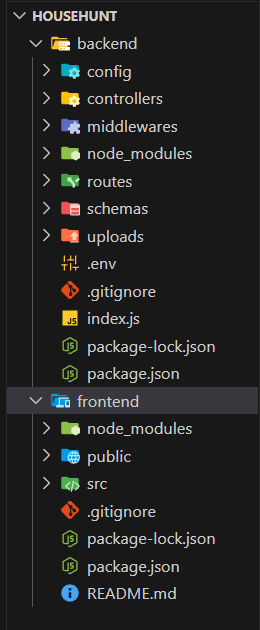

# 🏠 HouseHunt: Finding Your Perfect Rental Home

> A full-stack MERN web application designed to simplify the way people search, rent, and list homes — tailored for buyers, sellers, renters, and real estate professionals.

---

## 📌 Project Description

**HouseHunt** is a real estate platform that offers a modern and user-friendly interface to connect people looking for homes with those offering them. The platform supports advanced property search, interactive listings, neighborhood insights, real-time alerts, and professional connections — all aimed at streamlining the property rental and sales process.

---

## 🚀 Features

### 🔍 Advanced Property Search
- Filter by location, price, type, bedrooms, amenities, etc.
- Save searches for quick reuse

### 🏠 Property Listings
- High-quality photos, videos, and virtual tours
- Floor plans for better visualization

### 📈 Market Insights
- Local price trends and neighborhood data
- Investment potential analytics

### 🔔 Smart Alerts
- Get notified about new listings and price drops

### 🤝 Professional Support
- Connect with real estate agents, legal, and financial experts

---

## 🧰 Tech Stack

| Technology  | Description                          |
|-------------|--------------------------------------|
| MongoDB     | Database for user & property data    |
| Express.js  | REST API for server logic            |
| React.js    | Frontend UI framework                |
| Node.js     | Backend runtime                      |
| Vite        | Fast frontend build tool             |
| Bootstrap   | UI design and layout                 |
| JWT         | Secure authentication                |
| Axios       | API communication                    |

---

## 📁 Project Structure

